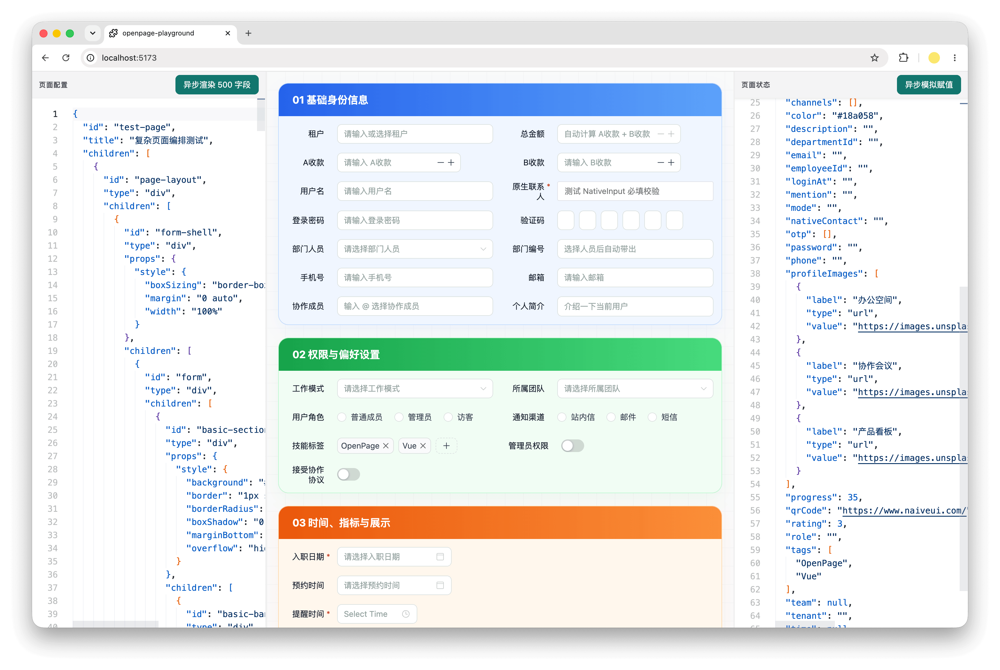

<p align="center">
  
</p>

> 这不是一个传统的低代码框架和标准实现，它在好用和方便扩展之间选择了一个相对好的平衡点，我们不追求极致的可视化，配合 AI 对框架的理解写 Javascript 脚本可能是最佳实现，没有各种事件编排的心智负担随心所欲直接操作状态，底层会尽可能的帮你处理性能的损耗无需担心

## OpenPage

OpenPage 是一套面向复杂业务落地的页面级 "低代码" 渲染器。它不把自己伪装成“拖拖拽拽就能解决一切”的玩具，而是把真实实施场景里最硬的部分拆开处理：Schema 渲染、状态绑定、表达式、事件脚本、UI 组件标准和调试能力。

它的核心目标很直接：

- 用 JSON Schema 描述页面结构和组件行为。
- 用外部受控 `state` 承载业务数据。
- 让组件按 `name` 直接绑定到状态路径，例如 `search.keyword` `page.table[0].name`。
- 让事件脚本可以像业务人员熟悉的方式一样读写状态。
- 用默认 UI 包提供一套可直接落地的 Naive UI 组件基座。
- 支持复杂 UI 稿还原可以直接写 style 样式， 并任意组合 div 元素实现任意布局。
- UI 包提供方法可以轻松接入任何自定义组件 无缝接入表单的验证功能。
- 性能足够快 在渲染前对整个 Schema 进行动态字段的收集，仅对发生变化的动态字段表达式字段进行计算和依赖


## Packages

| 包名 | 职责 |
| --- | --- |
| `@openpage/core` | 页面渲染核心，负责 Schema 编译、运行时上下文、状态绑定、表达式求值、事件执行和组件调度。 |
| `@openpage/ui` | 默认 UI 基座，基于 Naive UI 提供组件映射、表单包装、字段组件、展示组件和交互组件。 |
| `@openpage/script-runner` | 独立脚本执行器，负责执行用户脚本、代理状态读写、记录 patches、事务回滚和调试信息。 |

## 为什么拆成这些包

OpenPage 的边界不是“做一个 UI 组件库”，也不是“做一个表单库”。它是一个运行时系统。

`@openpage/core` 只关心页面如何被编译和执行；`@openpage/ui` 只关心默认组件如何呈现和接入 Naive UI 能力；`@openpage/script-runner` 只关心脚本如何安全、可观测地修改状态。这样拆开后，核心能力可以持续进化，而不会被某个 UI 组件或某段业务脚本拖进泥潭。

## 快速示例

```vue
<script setup lang="ts">
import type { PageSchema } from '@openpage/core'
import { Page } from '@openpage/core'
import { getComponents } from '@openpage/ui'
import { reactive } from 'vue'

const components = getComponents()

const state = reactive({
  search: {
    keyword: '',
  },
})

const schema: PageSchema = {
  id: 'demo-page',
  children: [
    {
      id: 'keyword',
      type: 'input',
      name: 'search.keyword',
      label: '关键词',
      props: {
        placeholder: '请输入关键词',
      },
    },
    {
      id: 'submit',
      type: 'button',
      label: '查询',
      props: {
        type: 'primary',
        tooltip: {
          text: '读取 state.search.keyword 并执行查询',
        },
      },
      events: {
        onclick: `
          console.log('keyword:', search.keyword)
          message.success('查询已触发')
        `,
      },
    },
  ],
}
</script>

<template>
  <Page
    v-model:state="state"
    :components="components"
    :schema="schema"
  />
</template>
```

## `@openpage/core`

核心包提供页面运行时的骨架：

- `Page`：Vue 页面渲染组件。
- `compileSchema`：将树形 Schema 编译为运行时结构。
- `PageSchema` / `ComponentSchema`：页面和组件配置类型。
- 表达式求值：支持 `{{ ... }}` 形式的动态值。
- 事件脚本：组件事件触发后执行脚本。
- 状态绑定：组件 `name` 默认映射到 `state` 路径。
- 交互样式：为组件生成稳定的交互 class 和 CSS。

核心层不绑定某个具体 UI 组件库。它通过 `components` 映射找到真实组件，再把编译后的组件配置、状态值和事件能力传下去。

## `@openpage/ui`

UI 包是 OpenPage 默认的 Naive UI 基座，提供：

- `getComponents()`：获取默认组件映射。
- `getThemeOverrides()`：获取默认主题配置。
- 输入类组件：`input`、`textarea`、`password`、`inputNumber`、`select`、`treeSelect` 等。
- 展示类组件：`images`、`carousel`、`qrCode`、`div`。
- 操作类组件：`button`，支持 `tooltip` 和 `popconfirm`。
- 表单接入能力：通过默认包装器复用 Naive UI 的校验 UI 和交互反馈。

当 `popconfirm` 和 `tooltip` 同时配置到按钮上时，`popconfirm` 优先生效。确认动作比悬浮提示优先级更高，这是更稳的交互语义。

## `@openpage/script-runner`

脚本执行器是独立包，不依赖 core 或 UI。它只做一件事：给定脚本字符串、`state` 和 `helpers`，执行脚本并返回结果。

```ts
import { runScript } from '@openpage/script-runner'

const state = {
  form: {
    amount: 10,
  },
}

const result = await runScript(`
  form.amount = form.amount + 5
  message.success('已更新金额')
`, {
  state,
  helpers: {
    message: {
      success: console.log,
    },
  },
  debug: true,
})

console.log(result.ok)
console.log(result.patches)
console.log(state.form.amount)
```

它支持：

- 状态代理：脚本里可以直接写 `form.amount = 15`。
- 事务回滚：脚本失败时默认回滚本次写入。
- patches：记录脚本产生的状态变更。
- debug：记录读取路径和 helper 调用。
- 错误隔离：脚本出错不会直接拖垮页面。
- 自定义错误格式化：上层可以注入页面、组件、事件等上下文。

## 本地开发

```sh
pnpm install
pnpm typecheck
pnpm test
pnpm build
```

Playground 用于人工验证复杂 Schema、状态联动和 UI 行为：

```sh
pnpm run dev
```

## 当前定位

OpenPage 目前更像一个面向真实业务实施的底层引擎，而不是通用搭建平台的完整产品。它优先解决这些硬问题：

- 页面结构如何稳定渲染。
- 大量组件如何共享运行时上下文。
- 状态如何统一绑定和更新。
- 脚本如何既直观又可控。
- UI 组件如何按标准扩展。
- 复杂实施场景如何可调试、可定位、可维护。

这条路不轻松，但方向很清楚：把低代码里最容易变成泥潭的部分，拆成可组合、可验证、可演进的工程模块。
