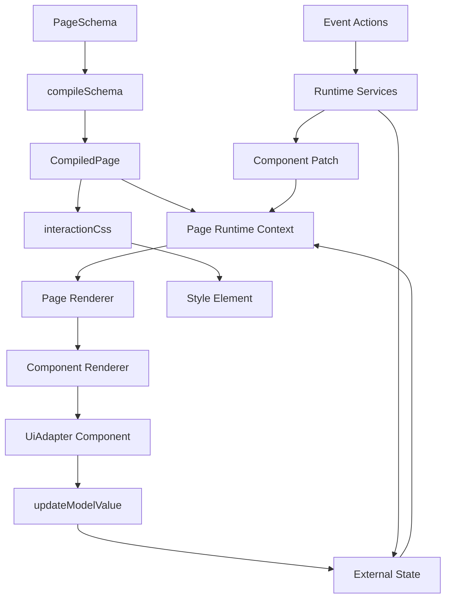
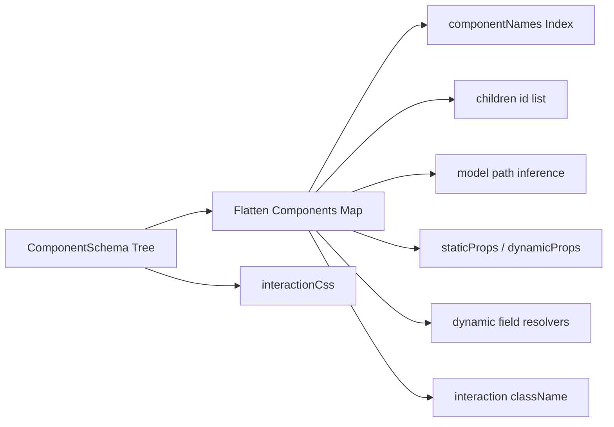
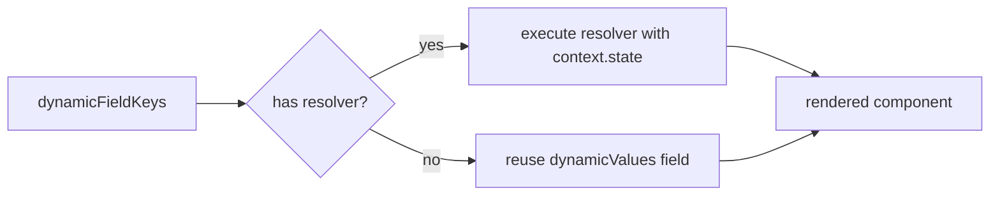
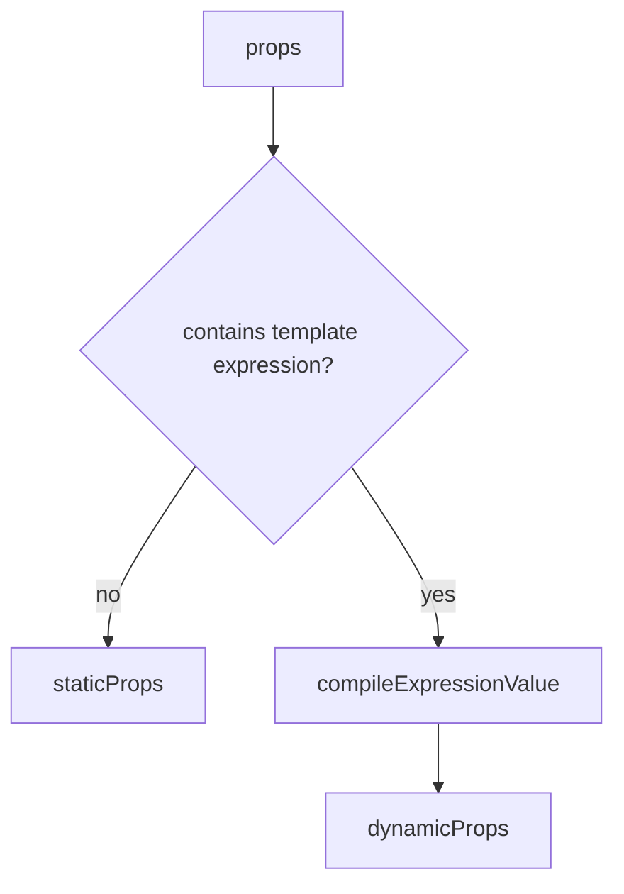
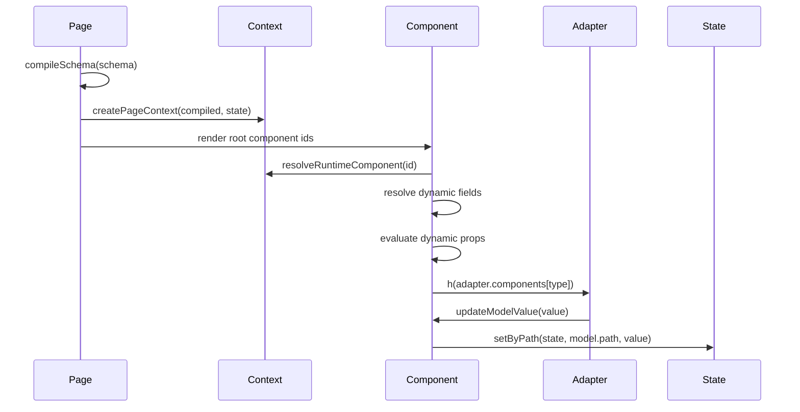
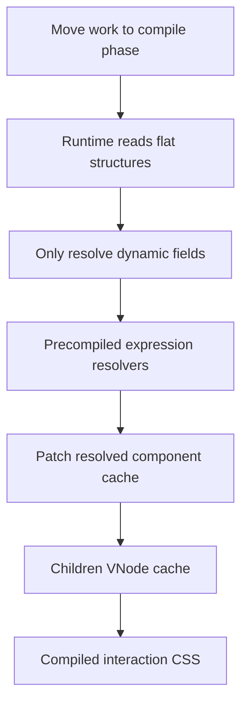

# OpenPage Core 架构设计

本文档说明 `@openpage/core` 的整体设计、运行链路、核心模块职责和性能优化策略。它面向维护者和后续扩展者：读完之后，应当知道一份 JSON Schema 如何被编译、如何进入 Vue 运行时、动态字段如何联动，以及为什么当前实现能在大页面下保持较低开销。

## 目标

`@openpage/core` 是一个 JSON Schema 驱动的 Vue 页面渲染核心。它不绑定具体 UI 组件库，而是通过 `UiAdapter` 把 schema 中的 `type` 映射到实际组件。

核心目标：

- 用 schema 描述页面结构、组件配置、事件和联动。
- 用外部 `state` 承载业务数据，core 不拥有业务数据源。
- 把 schema 编译成适合运行时读取的扁平结构。
- 只在运行时处理真正动态的字段，静态配置尽量复用。
- 支持运行时 patch 组件展示配置，同时保持响应式联动。
- 将 UI 组件库差异隔离在 adapter 层。

## 总览



页面首次渲染时，`PageSchema` 先被编译为 `CompiledPage`。之后渲染器只读取编译产物，不直接递归扫描原始 schema。

## 模块职责

| 模块 | 职责 |
| --- | --- |
| `compiler/compileSchema.ts` | 把树形 `PageSchema` 编译为扁平 `CompiledPage`。 |
| `compiler/compileProps.ts` | 拆分静态 props 和动态 props，并预编译动态 props resolver。 |
| `compiler/options.ts` | 维护可配置动态字段列表。 |
| `renderer/Page.ts` | 创建页面上下文、管理 schema/state/platform 更新、渲染顶层组件。 |
| `renderer/Component.ts` | 渲染单个组件，解析动态字段和 props，挂接 model 与事件。 |
| `runtime/expression.ts` | 判断、解析、编译并执行模板表达式。 |
| `runtime/components.ts` | 提供组件查询、运行时 patch、resolved component 缓存。 |
| `runtime/vue/useComputedValues.ts` | 集中调度 `computedValue` 字段，避免每个普通组件都创建监听。 |
| `interactions/css.ts` | 收集 hover/focus/active 等交互样式 CSS。 |
| `interactions/usePageInteractionStyles.ts` | 根据编译产物中的 `interactionCss` 管理 style 标签。 |
| `types/*` | Schema、编译产物、运行时和 adapter 类型定义。 |

## 编译阶段

编译阶段的核心任务是把树形 schema 转换成运行时友好的结构。



编译产物核心结构：

```ts
interface CompiledPage {
  id: string
  children: string[]
  components: Map<string, CompiledComponent>
  componentNames: Map<string, string>
  interactionCss: string
}
```

为什么要扁平化：

- 渲染单个组件时可以通过 `id` O(1) 读取组件配置。
- 运行时 patch 不需要递归查找树节点。
- `componentNames` 支持按业务名称快速查询。
- Vue 组件树仍按 `children` id 渲染，但配置读取不再递归。

## 动态字段配置

动态字段不是写死在渲染器里的，而是由 `compiler/options.ts` 集中配置：

```ts
export const defaultDynamicFieldKeys = [
  'label',
  'visible',
  'disabled',
  'required',
  'defaultValue',
] as const
```

如果后期新增可动态求值字段，只维护 `dynamicFieldKeys` 即可。编译、patch、渲染都会自动跟随。

```ts
compileSchema(schema, {
  dynamicFieldKeys: ['label', 'visible', 'description'],
})
```

每个组件会生成：

- `dynamicValues`：动态字段原始值。
- `dynamicFieldKeys`：当前组件需要关心的动态字段列表。
- `dynamicResolvers`：真正包含表达式的字段才会被编译成 resolver。

运行时渲染时只遍历 `dynamicFieldKeys`：



## Props 编译策略

组件 props 是高频热路径。当前设计在编译期拆分：

- `staticProps`：不含模板表达式，运行时直接复用。
- `dynamicProps`：含模板表达式，编译为 `[key, resolver]`。
- `props`：保留原始合并后 props，供 patch 和兼容读取使用。



渲染时：

```ts
if (component.dynamicProps.length === 0) {
  return component.staticProps
}

const props = { ...component.staticProps }
for (const [key, resolveValue] of component.dynamicProps) {
  props[key] = resolveValue(context)
}
```

这避免了每次渲染都对所有 props 做 `Object.entries`、深递归、字符串判断和表达式解析。

## 运行时上下文

`Page` 创建 `PageContext`，并通过 provide/inject 提供给所有 `Component`。

```ts
interface RuntimeContext {
  compiled: CompiledPage
  state: Record<string, unknown>
  services: RuntimeServices
  componentPatches: Record<string, ResolvedRuntimeComponentPatch | undefined>
}
```

运行时上下文包含：

- 当前编译产物。
- 响应式 state。
- 事件、消息、状态通知等服务。
- 组件运行时 patch。

## 渲染链路



`Component` 不直接知道具体 UI 组件库，它只把统一 props 传给 adapter 组件：

```ts
const adapterProps = {
  component,
  context,
  value,
  emitComponentEvent,
  updateModelValue,
}
```

## Model 绑定

表单内字段会根据表单 `name` 和字段 `name` 自动推导模型路径。

```json
{
  "id": "user-form",
  "type": "form",
  "name": "form",
  "children": [
    {
      "id": "username",
      "type": "input",
      "name": "username"
    }
  ]
}
```

编译后字段 model：

```ts
{
  path: 'form.username'
}
```

运行时读取和写入通过 `getByPath` / `setByPath` 完成。

## 事件与联动

事件支持两类：

- 字符串脚本事件。
- `static` 联动事件。

事件脚本通过 `runtime/actions.ts` 执行，并暴露 helper：

- `getComponentById`
- `getComponentByName`
- `updateComponentById`
- `updateComponentByName`
- `getState`
- `setState`
- `submitForm`
- `message`

运行时 patch 会在写入时预处理：

```mermaid
flowchart TD
  A[updateComponentById] --> B[merge patch]
  B --> C[compile patched props]
  B --> D[compile dynamic field resolvers]
  C --> E[resolvedComponent]
  D --> E
  E --> F[componentPatches[id]]
```

读取时直接返回 `resolvedComponent`，避免每次渲染都重新合并对象。

## Computed Value 调度

`computedValue` 不在每个普通组件里创建监听，而是由 `useComputedValues` 集中扫描编译产物，只为有 `computedValue` 和 `model.path` 的组件创建 watcher。

设计重点：

- 普通组件不额外创建计算监听。
- 多个计算字段同一轮更新时合并 `notifyStateChange`。
- 对同一路径重复写入做循环保护。

## 交互样式

交互样式包括：

- `hover`
- `focus`
- `focusWithin`
- `active`

早期实现会 deep watch schema 并重新收集 CSS。现在 CSS 在编译阶段生成：

```ts
CompiledPage.interactionCss
```

运行时只监听：

- `compiled.id`
- `compiled.interactionCss`

这样避免大 schema 下 deep watch 带来的隐性成本。

## 性能策略

当前 core 的性能策略可以总结为：



已经落地的优化：

- schema 扁平化。
- props 静态/动态拆分。
- 动态 props resolver 预编译。
- 可配置动态字段 resolver 预编译。
- patch 写入时生成 resolved component，读取 O(1)。
- 组件 children VNode 引用缓存。
- 页面 root children VNode 引用缓存。
- interaction CSS 编译化，去掉 schema deep watch。

## Benchmark 结果

当前基准集中在 `src/renderer/*.bench.ts`。

运行：

```sh
pnpm bench:core
```

典型结果：

| 场景 | 结果 |
| --- | --- |
| 静多动少 props | 约 `1.6x` faster |
| 全动态复杂 props | 约 `1.5x` faster |
| patch 读取缓存 | 约 `13x+` faster |
| children VNode 缓存命中 | 大幅提升 |
| 1000 组件 schema compile | 毫秒级 |
| 10000 组件 schema compile | 约几十毫秒级 |

注意：VNode 缓存命中 benchmark 是微基准，它证明热路径开销被压低，但真实页面体验还取决于 Vue mount、UI 组件库、DOM 数量、layout 和 paint。

## 能力边界

Core 很快，但它不能替浏览器消化无限 DOM。

当页面达到几千甚至上万真实 UI 组件时，主要瓶颈通常变成：

- Vue 组件实例创建。
- UI 组件库内部渲染。
- DOM 数量。
- 样式计算。
- layout / paint。
- Monaco 等编辑器显示超大 JSON。

这类场景应由页面层处理：

- 虚拟滚动。
- 分组折叠。
- 分页。
- 分批挂载。
- 压测模式下隐藏超大 JSON 编辑器。

不要为了极端 10000+ 真实控件场景，把 core 设计成复杂难维护的增量编译系统。1000 组件以内的业务页面才是当前主要优化目标。

## 扩展建议

新增动态字段：

1. 更新传入 `compileSchema` 的 `dynamicFieldKeys`，或调整 `defaultDynamicFieldKeys`。
2. 不需要修改 `Component.ts`。
3. 不需要修改 runtime patch 逻辑。

新增 UI 组件：

1. 在 adapter 的 `components` 中注册组件。
2. schema 中使用对应 `type`。
3. 组件实现遵守 `UiComponentProps` 协议。

新增事件能力：

1. 扩展 `runtime/actions.ts`。
2. 保持 helper API 小而明确。
3. 避免事件脚本直接操作内部编译产物。

## 维护原则

- 能在编译期做的，不放到渲染热路径。
- 能用扁平索引读取的，不递归查找。
- 静态配置复用，动态配置才求值。
- patch 在写入时消化成本，读取时保持轻。
- core 不替业务页面解决无限 DOM；大规模真实渲染交给虚拟化和懒挂载。
